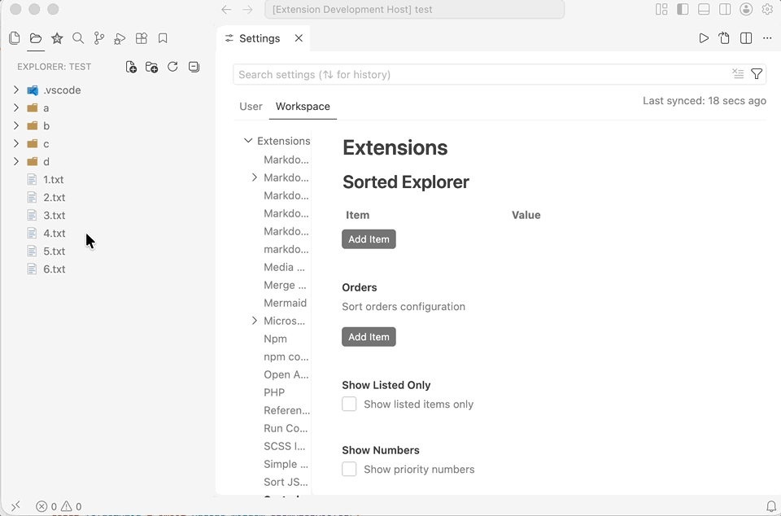

# Sorted Explorer
A powerful VS Code extension that allows you to sort files and folders and reorder them using drag & drop.

## Features
1. Sort files and folders using drag & drop.
2. Set custom labels.
3. Show numbers before items.

